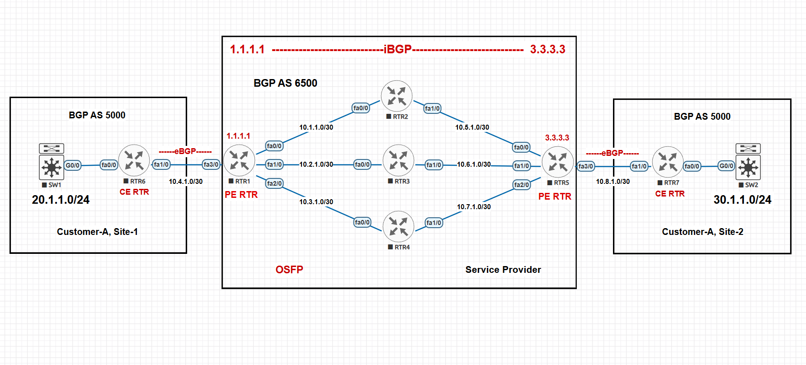

# MPLS Backbone with BGP & OSPF – Lab Documentation  

## 📌 Overview  
This lab demonstrates a **service provider MPLS backbone** interconnecting two customer sites using **eBGP, iBGP, and OSPF**. The goal is to simulate real-world ISP operations where customer edge routers (CE) connect to provider edge routers (PE), which in turn maintain reachability through the MPLS core.  

---

## 🖼 Topology  
  

- **Customer-A Site-1** → AS 5000 (Subnet: `20.1.1.0/24`)  
- **Customer-A Site-2** → AS 5000 (Subnet: `30.1.1.0/24`)  
- **Service Provider Core** → AS 6500  
  - IGP: OSPF  
  - Edge-to-core: iBGP  
  - Customer-to-provider: eBGP  

---

## 🔧 Technologies Used  
- **BGP (eBGP & iBGP)** → Route exchange between customer and provider, and across PE routers.  
- **OSPF** → Interior routing protocol within the provider backbone.  
- **MPLS-ready Core** → (Even though MPLS labels not configured here, topology mirrors MPLS ISP design).  

---

## ⚙️ Devices  
- **CE Routers**: RTR6, RTR7 (Customer side)  
- **PE Routers**: RTR1, RTR5 (Edge of SP)  
- **P Routers**: RTR2, RTR3, RTR4 (Core routers)  
- **Switches**: SW1, SW2 (Customer LAN)  

---

## 🗂 How to Use  
1. Import `mpls-lab-configurations.zip` into **EVE-NG** (`Import Lab` option).  
2. Load topology, start all devices.  
3. Extract `Configs.zip` → contains individual `show run` outputs (RTR1.cfg, RTR2.cfg, etc.).  

---

## ✅ Verification Commands  

### On CE Routers (RTR6, RTR7)  
```bash
ping 30.1.1.1 source 20.1.1.1
traceroute 30.1.1.1
show ip bgp summary
```

### On PE Routers (RTR1, RTR5)  
```bash
show ip bgp summary
show ip route bgp
show ip ospf neighbor
```

### On Core Routers (RTR2, RTR3, RTR4)  
```bash
show ip ospf neighbor
show ip route ospf
```

Expected outcome: **CE Site-1 (20.1.1.0/24) can reach CE Site-2 (30.1.1.0/24)** through the provider network.  

---

## 📦 Files in this Project  
- `mpls-lab-configurations.png` → Clean topology diagram  
- `Configs.zip` → Router configs (RTR1.cfg … RTR7.cfg)  
- `mpls-lab-configurations.zip` → EVE-NG export (ready-to-import lab)  
- `README.md` → This documentation  
